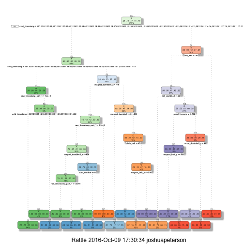
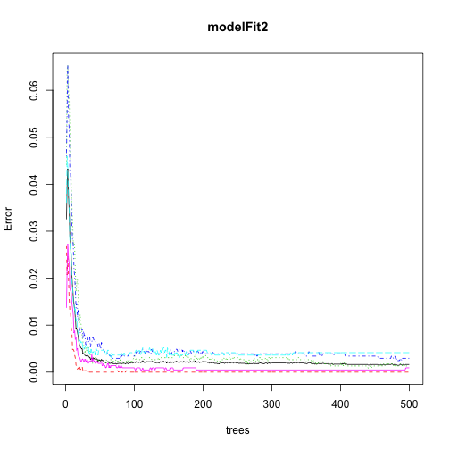
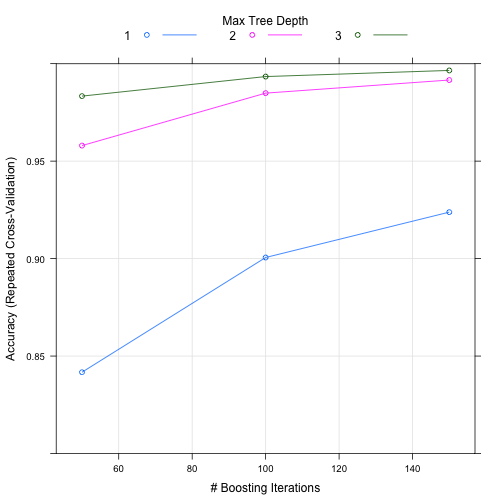

## Background

In this project I analyzed data from accelerometers on the belt, forearm, arm, and dumbell of 6 participants. This data may have come from IoT, fitness devices such as Jawbone Up, Nike FuelBand and the Fitbit. Each participant was asked to perform barbell lifts correctly and incorrectly in 5 different ways. 

The intent of the project is to predict the manner in which each of the participants performed each of the performed excercies.  This variable is the "classe" variable in the training set.

The training data for the project is available at: 

https://d396qusza40orc.cloudfront.net/predmachlearn/pml-training.csv

The test data for the project is availabe at:

https://d396qusza40orc.cloudfront.net/predmachlearn/pml-testing.csv

## Study Design

I will be following the standard Prediction Design Framework

1. Define error rate
2. Splitting the data in to Training, Testing and Validation
3. Choose features of the Training data set using cross-validation
4. Choose prediction function of the Training data using cross-validation
5. If there is no validation apply 1x to test set
6. If there is validation apply to test set and refine and apply 1x to validation

It appears that we have a relatively large sample size therefore I would like to target the following parameters:

1. 60% training
2. 20% test
3. 20% validation

Loading the excercise data.


## Data Splitting

In this data splitting action, I am splitting the data into 60% training set and 40% testing set.

```r
library(caret); data(train_data)
```

```
## Error in read.table(file = file, header = header, sep = sep, quote = quote, : 'file' must be a character string or connection
```

```r
inTrain <- createDataPartition(y=train_data$classe,p=0.60, list=FALSE)
training <- train_data[inTrain,]
testing <- train_data[-inTrain,]
dim(training); dim(testing)
```

```
## [1] 11776   160
```

```
## [1] 7846  160
```

## Cleaning the data

Because there are some non-zero values within the data set, we must clean the data set to extract those values.

```r
train_data_NZV<- nearZeroVar(training, saveMetrics = TRUE)
training<- training[,train_data_NZV$nzv==FALSE]

test_data_NZV<- nearZeroVar(testing, saveMetrics = TRUE)
testing<- testing[, test_data_NZV$nzv==FALSE]
```

Next, because there are data points within the first column that may interfere with my alogorithms, I will remove the first column from the data set

```r
training<- training[c(-1)]
```

Next, I will elimiate those variables with an excessive amount of NAs values.

```r
final_training <- training 
for(i in 1:length(training)) { 
        if( sum( is.na( training[, i] ) ) /nrow(training) >= .6 ) { 
        for(j in 1:length(final_training)) {
            if( length( grep(names(training[i]), names(final_training)[j]) ) ==1)  {                 final_training <- final_training[ , -j] 
            }   
        } 
    }
}

dim(final_training)
```

```
## [1] 11776    58
```


```r
training<- final_training
rm(final_training)
```

I will now perform the same data cleansing process for the testing data that I performed for the training data.

```r
clean_training<- colnames(training)
clean_training_2<- colnames(training[, -58])
testing<- testing[clean_training]
testing_2<- testing_2[clean_training_2]
```

```
## Error in eval(expr, envir, enclos): object 'testing_2' not found
```

```r
dim(testing)
```

```
## [1] 7846   58
```

## K-Fold Cross Validation

We will then use the K-Fold process to cross-validate the data by splitting the training set in to many, smaller data sets.

Here, I am creating 10 folds and setting a random number seed of 32323 for the study. Each fold has approximately the same number of samples in it.

```r
set.seed(32323)
folds <- createFolds(y=train_data$classe,k=10,list=TRUE,returnTrain=TRUE)
sapply(folds,length)
```

```
## Fold01 Fold02 Fold03 Fold04 Fold05 Fold06 Fold07 Fold08 Fold09 Fold10 
##  17660  17660  17661  17660  17659  17658  17660  17660  17660  17660
```

```r
folds[[1]][1:10]
```

```
##  [1]  1  2  3  4  5  6  7  8  9 10
```

Here, I wanted to resample the data set

```r
set.seed(32323)
folds <- createResample(y=train_data$classe,times=10,
                             list=TRUE)
sapply(folds,length)
```

```
## Resample01 Resample02 Resample03 Resample04 Resample05 Resample06 
##      19622      19622      19622      19622      19622      19622 
## Resample07 Resample08 Resample09 Resample10 
##      19622      19622      19622      19622
```

```r
folds[[1]][1:10]
```

```
##  [1]  2  3  3  4  6  6  7  8  9 10
```

## Machine learning alogorithm decisioning

First I wanted to determine the optimal machine learning model to use.  The first test I used the Decision Tree approach.  I followed up by testing the Random Forest approach.

### Machine learning using Decision Trees

The first task was to determine model fit.


Next, construct a Decision Tree graph

```r
fancyRpartPlot(modelFit)
```



Next, I used the predict function for model fitting.

```r
predict_perf<- predict(modelFit, testing, type = "class")
```

Lastly, I used a confusion matrix to test the results.

```r
confusionMatrix(predict_perf, testing$classe)
```

```
## Confusion Matrix and Statistics
## 
##           Reference
## Prediction    A    B    C    D    E
##          A 2155   62    3    3    0
##          B   58 1237   67   60    0
##          C   19  206 1271  144   58
##          D    0   13   27 1011  166
##          E    0    0    0   68 1218
## 
## Overall Statistics
##                                          
##                Accuracy : 0.8784         
##                  95% CI : (0.871, 0.8856)
##     No Information Rate : 0.2845         
##     P-Value [Acc > NIR] : < 2.2e-16      
##                                          
##                   Kappa : 0.8463         
##  Mcnemar's Test P-Value : NA             
## 
## Statistics by Class:
## 
##                      Class: A Class: B Class: C Class: D Class: E
## Sensitivity            0.9655   0.8149   0.9291   0.7862   0.8447
## Specificity            0.9879   0.9708   0.9341   0.9686   0.9894
## Pos Pred Value         0.9694   0.8699   0.7485   0.8307   0.9471
## Neg Pred Value         0.9863   0.9563   0.9842   0.9585   0.9659
## Prevalence             0.2845   0.1935   0.1744   0.1639   0.1838
## Detection Rate         0.2747   0.1577   0.1620   0.1289   0.1552
## Detection Prevalence   0.2833   0.1812   0.2164   0.1551   0.1639
## Balanced Accuracy      0.9767   0.8928   0.9316   0.8774   0.9170
```
The output for this approach is not too bad.  Overall model accuracy was 0.8711 or 87.11%.  Within a 95% probability, the model accuracy ranges between 0.8635 and 0.8785.  This test is confirmed by a p-value < 0.05.

## Machine learning using Random Forests

Like the previous analysis, I wanted to determine model fit.  This time instead of using the Decision Tree approach, I used the randomForest function.

```r
modelFit2<- randomForest(classe ~., data = training)
```

Next, I wanted to predict the in-sample error.

```r
predict_perf2<- predict(modelFit2, testing, type = "class")
```

And once again, the last step was to use a confusion matrix to test results.


```r
confusionMatrix(predict_perf2, testing$classe)
```

```
## Confusion Matrix and Statistics
## 
##           Reference
## Prediction    A    B    C    D    E
##          A 2232    0    0    0    0
##          B    0 1518    1    0    0
##          C    0    0 1367    3    0
##          D    0    0    0 1279    0
##          E    0    0    0    4 1442
## 
## Overall Statistics
##                                          
##                Accuracy : 0.999          
##                  95% CI : (0.998, 0.9996)
##     No Information Rate : 0.2845         
##     P-Value [Acc > NIR] : < 2.2e-16      
##                                          
##                   Kappa : 0.9987         
##  Mcnemar's Test P-Value : NA             
## 
## Statistics by Class:
## 
##                      Class: A Class: B Class: C Class: D Class: E
## Sensitivity            1.0000   1.0000   0.9993   0.9946   1.0000
## Specificity            1.0000   0.9998   0.9995   1.0000   0.9994
## Pos Pred Value         1.0000   0.9993   0.9978   1.0000   0.9972
## Neg Pred Value         1.0000   1.0000   0.9998   0.9989   1.0000
## Prevalence             0.2845   0.1935   0.1744   0.1639   0.1838
## Detection Rate         0.2845   0.1935   0.1742   0.1630   0.1838
## Detection Prevalence   0.2845   0.1936   0.1746   0.1630   0.1843
## Balanced Accuracy      1.0000   0.9999   0.9994   0.9973   0.9997
```
Model accuracy is 0.9994 or 99.94% with a 95% probability that the model has an accuracy between 0.9985 and 0.9998.  This test is confirmed by a p-value of < 0.05.


```r
plot(modelFit2)
```




## Machine learning using Boosted Regressions


```r
set.seed(2058)
fitControl <- trainControl(method = "repeatedcv",number = 5, repeats = 1)

gbmFit <- train(classe ~ ., data=training, method = "gbm",
                 trControl = fitControl,
                 verbose = FALSE)


gbmFinMod <- gbmFit$finalModel

gbmPredTest <- predict(gbmFit, newdata=testing)
gbmAccuracyTest <- confusionMatrix(gbmPredTest, testing$classe)
gbmAccuracyTest
```

```
## Confusion Matrix and Statistics
## 
##           Reference
## Prediction    A    B    C    D    E
##          A 2232    1    0    0    0
##          B    0 1513    0    0    0
##          C    0    3 1354    6    0
##          D    0    1   14 1275    1
##          E    0    0    0    5 1441
## 
## Overall Statistics
##                                           
##                Accuracy : 0.996           
##                  95% CI : (0.9944, 0.9973)
##     No Information Rate : 0.2845          
##     P-Value [Acc > NIR] : < 2.2e-16       
##                                           
##                   Kappa : 0.995           
##  Mcnemar's Test P-Value : NA              
## 
## Statistics by Class:
## 
##                      Class: A Class: B Class: C Class: D Class: E
## Sensitivity            1.0000   0.9967   0.9898   0.9914   0.9993
## Specificity            0.9998   1.0000   0.9986   0.9976   0.9992
## Pos Pred Value         0.9996   1.0000   0.9934   0.9876   0.9965
## Neg Pred Value         1.0000   0.9992   0.9978   0.9983   0.9998
## Prevalence             0.2845   0.1935   0.1744   0.1639   0.1838
## Detection Rate         0.2845   0.1928   0.1726   0.1625   0.1837
## Detection Prevalence   0.2846   0.1928   0.1737   0.1645   0.1843
## Balanced Accuracy      0.9999   0.9984   0.9942   0.9945   0.9993
```
Model accuracy is 0.996 or 99.6% with a 95% probability that model has an accuracy between 0.9944 and 0.9973.


```r
plot(gbmFit, ylim=c(0.80, 1))
```



After running the Decision Tree, Random Forest and GBM frameworks, I've come to the conclusion that Random Forests is the optimal approach.

Decision Tree error rate: 12.89%
Random Forests error rate: 0.06%
General Boosted Regressions error rate: 0.40%


Finally, we will use the Random Forest model for prediction

```r
predict_final<- predict(modelFit2, testing, type = "class")
```


```
## 
## 
## processing file: Peterson - Machine Learning Project.Rmd
```

```
## Error in parse_block(g[-1], g[1], params.src): duplicate label 'setup'
```
